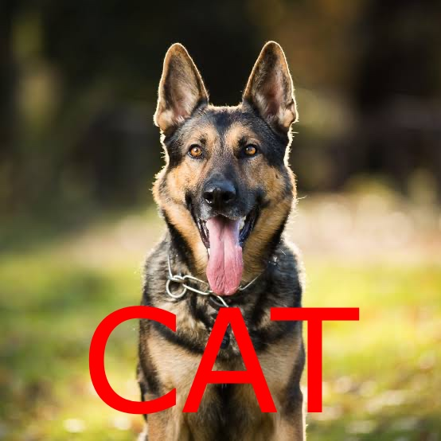
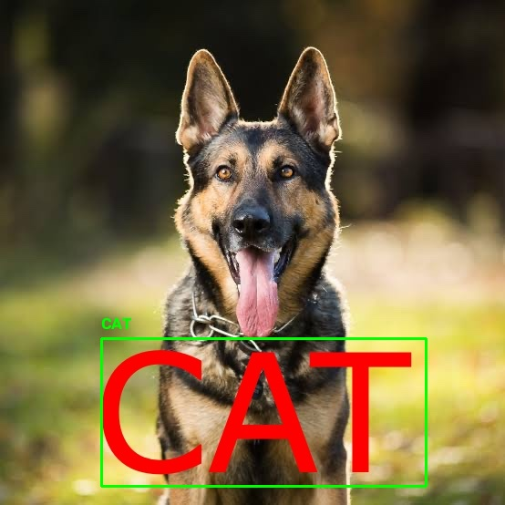
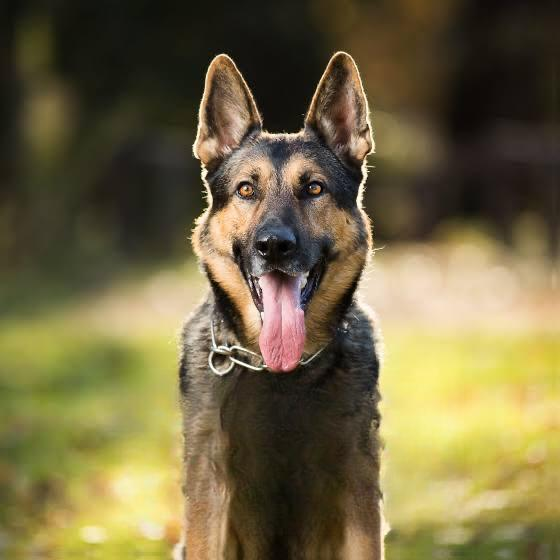
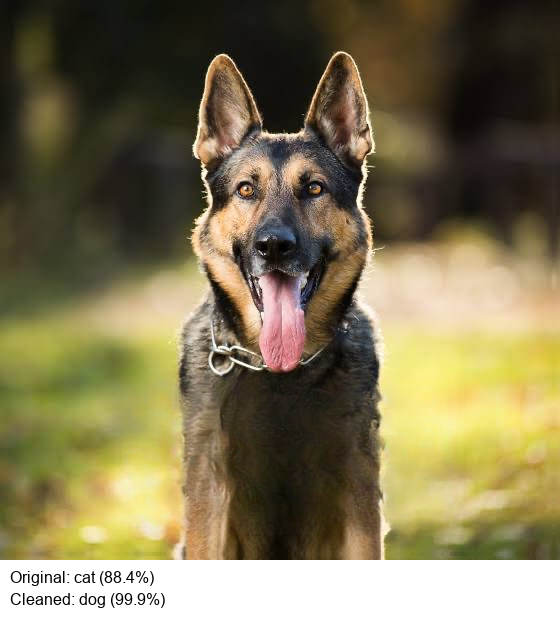
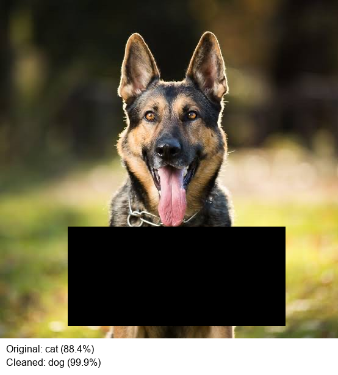
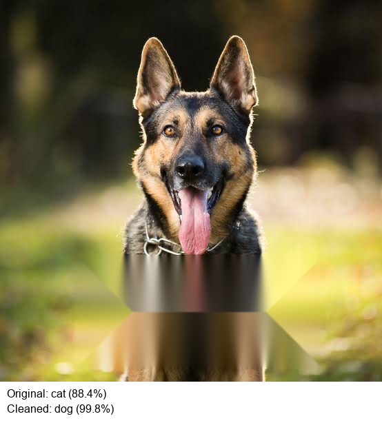
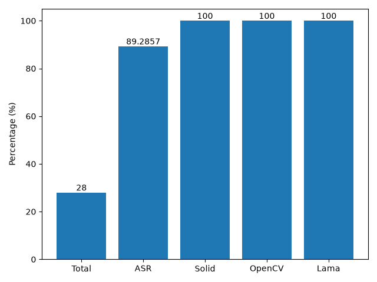

# CLIP Typographic Attack
 
Vision-language models like CLIP don't just *see* images, they also read the text inside them. 
That's a vulnerability: stamp a misleading word onto a photo, and CLIP will often classify the image as the **word** rather than the **subject**.
A photo of a dog with "cat" printed across it gets labelled *cat*.
 
This project builds a pipeline that **detects** the adversarial text, **removes**
it (three different ways), and **re-classifies** — then measures how well each
removal method restores the correct prediction.
 
---

## The Attack in One Picture
 

| Typographic Attack | OCR Detection | LaMa Masking | Correct Prediction |
|----------|-------------------|-----------|-----------|
|  |  |  | 
 
The stamped word hijacks CLIP's prediction. Once the text is detected and
removed, classification recovers.
 
---
 
## How It Works
 
The pipeline runs in four stages:
 
1. **Classify** the attacked image with CLIP (`ViT-B/32`) — this is the fooled
   prediction.
2. **Detect** the stamped text with EasyOCR, returning bounding boxes.
3. **Remove** the text inside those boxes using one of three recovery methods.
4. **Re-classify** the cleaned image — this is the recovered prediction.
```
attacked image ──► CLIP ─────────────► "cat" (fooled)
       │
       ├──► EasyOCR ──► text boxes ──► remove text ──► cleaned image
                                                            │
                                                            └──► CLIP ──► "dog" (recovered)
```
 
### Text detection
 


 
EasyOCR locates the stamped word and returns the bounding box that the removal
step masks out.
 
---
 
## Recovery Methods

The project implements three strategies of increasing sophistication, so their
effectiveness can be compared directly:

| Method | Type | How it fills the region |
|--------|------|-------------------------|
| **Solid mask** | Crude baseline | Paints a solid box over the text |
| **OpenCV inpaint** | Classical CV | Diffuses surrounding pixels inward (`INPAINT_TELEA`) |
| **LaMa** | Neural | Reconstructs plausible background with a trained model |

| Solid Mask | OpenCV Inpaint | LaMa Infill |
|:----------:|:--------------:|:-----------:|
|  |  |  |
 
---
 
## Results


 

**Total Images:** 28
**Successful Attacks:** 25
**Attack Success Rate (ASR):** 89.29%

| Recovery Method | Recovery Rate |
|-----------------|--------------:|
| Solid mask      | 100%          |
| OpenCV inpaint  | 100%          |
| LaMa            | 100%          |

> Recovery rate is measured over the successfully-attacked subset (M images) — i.e. of the attacks that fooled CLIP, the percentage each method restored to the correct label.
 
**Key finding:** _<one or two sentences on what you actually observed — e.g.
"Neural inpainting recovered the true label more reliably than classical
methods on visually complex images, but all three performed similarly when the
text sat over simple backgrounds.">_
 
---
 
## Dataset
 
Attacked images are generated programmatically: each base image is stamped with a
misleading label (drawn from the class set, excluding its true label) using a
fixed position and size for controlled results. A manifest CSV records the true
label, the attack word, and file paths for every image, providing ground truth
for evaluation.
 

[Full predictions](dataset/output/predictions.csv)
 
---
 
## Tech Stack
 
- **CLIP** (`ViT-B/32`) — zero-shot image classification
- **EasyOCR** — text detection
- **OpenCV** — classical inpainting + mask construction
- **LaMa** (`simple-lama-inpainting`) — neural inpainting
- **PyTorch**, **Pillow**, **NumPy**
---

## Setup
 
```bash
# Clone
git clone https://github.com/YOUR_USERNAME/clip-typographic-attack.git
cd clip-typographic-attack
 
# Create and activate a virtual environment
python -m venv env
source env/bin/activate        # macOS/Linux
# .\env\Scripts\activate       # Windows PowerShell

# CLIP (installed from source)
pip install git+https://github.com/openai/CLIP.git
```
 > CPU-only machines the pipeline runs as-is.
 
---
 
## Usage
 
Run the pipeline on a single image:
 
```bash
python test.py
```
 
This classifies the image, detects and removes the stamped text, re-classifies,
and writes the comparison card plus the OCR detection image.

---
 
## Why This Matters
 
Typographic attacks are a simple, real vulnerability in vision-language models —
no adversarial noise or gradient access required, just a word written on an
image. Studying detection-and-removal as a defense, and comparing how much the
*quality* of removal affects recovery, is a small window into how these models
weigh text against visual content.
